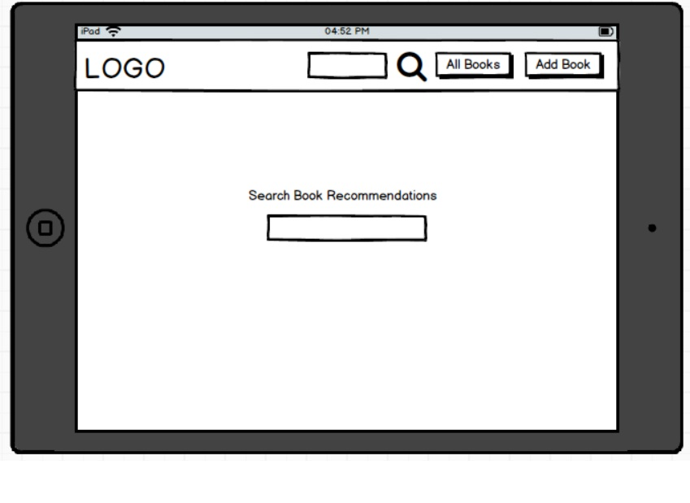

# Data Centric Development Project

This project is an online website for book recommendations and reviews. The goal was to make a site with backend database functionality using MongoDB. This site should allow users to modify the database by creating, updating, deleting as well as reading from it.

This is the third project as part of my [Code Institute](https://codeinstitute.net/) online diploma course.

---

## User Experience Design

### User Stories

These are potential actions that users of the website would want to perform. 

* As a user, I would like to be able to search for a book recommendation.
* As a user, I would like to upload a review for a book.
* As a user, I would like to be able to change reviews.
* As a user, I would like to delete reviews
* As a user, I would like to add my own books.
* As a user, I would like to delete books.
* As the site owner, I would like to make money off links provided in the book reviews

---

### Wireframes

## Database

Need to be able to store information on books. Since users are adding reviews for books, also need to store that too. Database must use MongoDB.

### Design

Book data to store: Title, Author and Link to a cover image of the book.

Review Data to store: User Name, Review content

Since one book can have many reviews, will store reviews as an embedded document inside the book document.

Book --> Title, Author, Cover Link, Review Data --> User Name, Content

### Implementation

Book data selected from sixteen random books on [Open Libary](openlibrary.org). This data was then added to the database using the MongoDB command line.

Review data was left blank and inserted later when the database was linked to the website. 

## Features

### Index Page

### All Books Page

### Search Page

### Book Review Page

### Edit Review Page

### Add Review Page

### Potential Additional Features

## Testing

## Deployment

Application was deployed to Heroku. The steps for this are as follows:

1. After logging into my Heroku account, I clicked 'New' and then 'Create New App'
2. I have to give my new app a name and pick my region as Europe.
3. I had to link my GitHub repository, containing all my code, to Heroku so I clicked the 'Deploy' tab.
4. I enter the details of my account and repository to link the two.
5. I then have to enable automatic deploys, so when I push to GitHub, it deploys my code to Heroku; so I click on that.
6. I had to enable environment variables for my project, so I click on 'Settings' > 'Reveal Config Vars' and enter in the ones my project uses.
7. I have to generate a Procfile for my project, which I did by typing "echo web: python run.py > Procfile" into the terminal.
8. I had to generate a requirements file as well, which I did by typing "sudo pip3 freeze --local > requirements.txt" into the terminal.
9. I had to disable the debug environment before deployment, which I did by removing 'True' from the line in my run.py file, and replacing it with 'False'
10. Once I have these changes added and committed using git, I had to push them to my git repository using 'git push' in the terminal. This also pushed the project to Heroku, where it began automatically installing dependencies and deploying the project.

## Credits

### Content

* Book icon on navbar courtesy of Font Awesome
* Navbar font and general site font taken from Google Fonts

### Media

* Book images and data taken from [Open Library](openlibrary.org)
* 'No book' image taken and modified from [here](https://cdn.pixabay.com/photo/2018/01/17/18/43/book-3088777_1280.png)

### Code

* Various code snippets copied from [Bootstrap's site](https://getbootstrap.com/)
* Four column code for search page and all books page taken from [here](https://startbootstrap.com/snippets/portfolio-four-column/)
* Code for fixing the footer in place copied from [here](https://www.freecodecamp.org/news/how-to-keep-your-footer-where-it-belongs-59c6aa05c59c/)